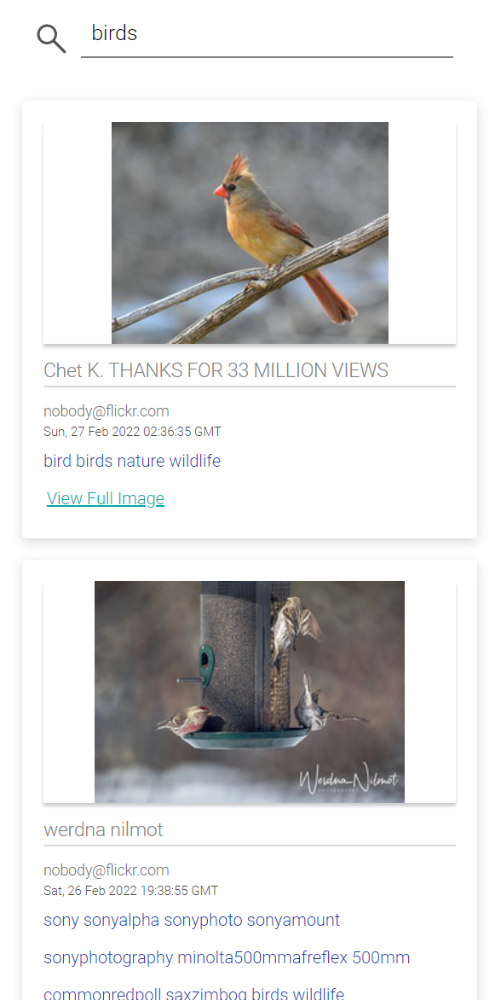

# Range Me Coding Task (RMCT)

The purpose of this repository is to build a web application to search Flickr photos by tags. 
The project was built using React. 
Tests were written using JEST and puppeteer.

## Installation
The solution includes two projects, range_me_coding_task for React clientside and puppeteer_tests for end to end testing.
* To run the clientside, please install dependencies using `yarn install` within the `range_me_coding_task` directory, and execute `yarn start`.
* Run Jest tests using `yarn test`.
* And to run the end to end tests, please install dependencies using `yarn install` within the `puppeteer_tests` directory, and execute `yarn test`
* Since we are just building a frontend project to access an API with a different origin, so we need to install a chrome plugin to disable same-origin policy in chrome to make the project functional:
  https://chrome.google.com/webstore/detail/allow-cors-access-control/lhobafahddgcelffkeicbaginigeejlf?hl=en
   
  (or other alternative plugins)

## Details
Several details have been considered during the development of this project.
* Jest tests and end-to-end tests, end-to-end tests are included to ensure the feature is fully functional.
* Responsive UX design.
* Debounce search input, fetch data from api with 500ms delay after user stop typing, to reduce redundant api calls
* Pagination for displaying flickr data items.

## Screenshots
On a large size window:
 

On a small size window:
 

When the search results are empty:
 

